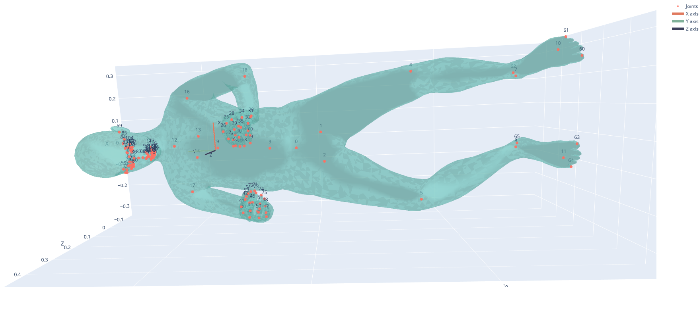

# Stickman to smplx

This repository uses the conventional 3d points of a person and creates the smplx mesh out of them. Using the mesh, it can then be imported in Blender.
This repo uses python 3.11.9

## Setup Instructions

### Setup Environment
Create a new Python virtual environment (recommended to keep dependencies isolated) and download requirements.

- **Windows (PowerShell or CMD):**
  ```powershell
  python -m venv venv
  .\venv\Scripts\activate
  pip install --upgrade pip
  pip install -r requirements.txt

Download the smplx models from the [project website](https://smpl-x.is.tue.mpg.de/) and put the models folder in the same directory.

## Generate SMPL-X Joint Points

This script maps your custom 3D body and hand keypoints into the **SMPL-X joint format**.

### 1. Map stickman data to SMPL-X
Run the mapping script with your input body and hand joint files:

```
python mapping_stickman_to_smplx.py --body BODY_FILE --hand HAND_FILE [--output OUTPUT_FILE]
```

### 2. Get the Mesh from SMPL-X partial joints
Run the script to approximate the best fitting smpl-x mesh to the given joints:

```
python get_mesh_from_3dpoints.py
```

### 3. Visualize the mesh
After generating the meshes and joints, you can visualize any frame with:

```
python visualize.py --frame FRAME_NUMBER
```
This will open an interactive 3D plot (saved as 3d_smplx_plot.html) showing the SMPL-X body mesh along with joint markers and axes.


 
